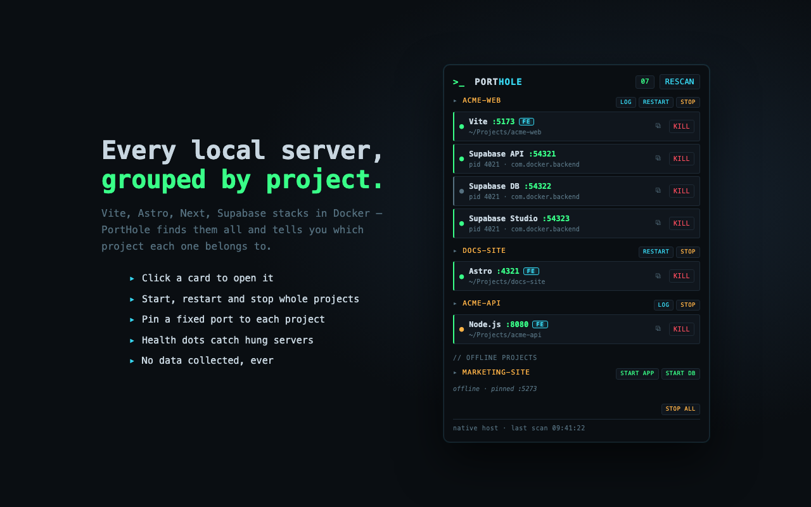

<p align="center">
  
  
</p>

<h1 align="center">PortHole</h1>

A window onto your local dev servers. See what's running on your Mac — grouped by project, straight from a Chrome toolbar popup — open them, start them, restart them, kill them, and pin each project to its own port.



macOS is the tested platform. Linux paths are included in the installer but untested; Windows is not supported yet (the port scan uses `lsof`). Requires Node.js.

Two parts:

- **`helper/`** — a zero-dependency Node **native messaging host** (`host.js` + `core.js`). Chrome spawns it on demand; nothing runs in the background. It scans listening TCP ports with `lsof`, labels them (Vite, Next.js, Supabase API/Studio/DB, Postgres, …), and **groups servers by project**: regular processes via their working directory, Docker/Supabase ports via `docker ps` container names (`supabase_studio_<project>` → project). It can kill servers (SIGTERM / `docker stop`), start, restart, and stop whole projects. OS/app noise (Dropbox, Raycast, AirPlay, …) is filtered out, and the host only answers the extension ID registered at install time.
- **`extension/`** — a Manifest V3 Chrome extension with a terminal-styled popup: servers grouped by project, click a card to open it (non-HTTP ports like Postgres shown but not clickable), KILL/START/RESTART/STOP controls, log viewer, health dots.

## Setup (Chrome Web Store install)

1. Install PortHole from the Chrome Web Store and pin it to the toolbar.
2. Open the popup — it shows a one-time setup command with your extension ID
   filled in. Run it in any terminal:

   ```bash
   npx porthole-helper install <extension-id>
   ```

3. Click RESCAN in the popup.

The helper is copied to `~/.porthole/` and registered with every Chrome-family
browser. No always-on process: Chrome launches it per request and it exits
after answering.

## Setup (developing from this repo)

1. **Load the extension unpacked**
   - Open `chrome://extensions`, enable **Developer mode**
   - Click **Load unpacked** and select the `extension/` folder

2. **Register the native helper**

   ```bash
   ./helper/install.sh
   ```

   This derives the unpacked extension's ID from its path and registers it via
   the same CLI end users get from npm. If the popup still says it can't
   connect, copy the real ID from `chrome://extensions` and rerun
   `./helper/install.sh <id>`.

## Publishing to the Chrome Web Store

Store assets live in `store/`:

- `./store/build.sh` rebuilds `store/porthole.zip` (the upload package)
- `store/screenshot-1.png` (1280×800) and `store/promo-440x280.png` are listing graphics,
  regenerated by rendering `store/_screenshot.html` / `store/_promo.html` in headless Chrome
- `STORE_LISTING.md` holds the listing copy, permission justification and reviewer notes
- `PRIVACY.md` is the privacy policy the listing links to

After the first draft upload, put the assigned item ID into `PUBLISHED_ID` in
`helper/install.sh` so store installs register the right extension ID. The
installer allows several IDs at once, so store and unpacked-dev installs coexist.

## Debug mode (optional)

`node helper/server.js` serves the same commands over HTTP for curl:
`GET /servers`, `POST /kill?type=&target=`, `POST /start?project=&what=app|supabase`,
`POST /restart?project=`, `GET /logs?project=&what=`, `POST /stop?project=`, `POST /stopall`.

## Project registry

Without a registry PortHole still lists, opens, and kills servers — the registry
is what unlocks START / RESTART / STOP, pinned ports, and conflict warnings.

**The easy way:** any running project that isn't registered yet gets a dashed
**+ SETUP** button. One click writes the entry for you — directory from the
process's working directory, start command inferred from `package.json`
(`dev`, else `start`), the port it's already using pinned, and Supabase detected
from `supabase/config.toml`. Nothing to type.

**By hand:** create `~/.porthole/projects.json` (an example lands next to it at
install time; repo developers can use a git-ignored `helper/projects.json`
instead) mapping each project to its directory, start command, pinned port, and
whether it has a Supabase stack:

```json
"my-app": {
  "dir": "/path/to/my-app",
  "start": "npm run dev -- --port $PORT",
  "port": 5173,
  "supabase": true
}
```

- Registered projects appear in the popup even when **offline**, with **START APP** / **START DB** buttons; running ones get **RESTART**.
- `$PORT` in the start command (and the `PORT` env var) is filled from `port` — that's how a project always gets the same port. Works with `vite --port`, `astro dev --port`, Next.js (`PORT` env), etc.
- **START DB** runs `npx supabase start` in the project dir. The first run for a
  stack pulls Docker images and can take several minutes — the project shows a
  live **STARTING SUPABASE** row with elapsed time and the latest log line until
  it finishes, and that survives closing and reopening the popup.
- Start/restart output is logged to `~/.porthole/logs/<project>-<what>.log`.
- The file is re-read on every request — edit it and just reopen the popup.

## Other features

- **Health dots** — green pulsing = serving; amber blinking = port open but not answering HTTP (hung, or a non-HTTP service like Supabase Analytics).
- **Log viewer** — LOG / DB LOG buttons tail `~/.local-servers-logs/` inline (ANSI-stripped).
- **Port-conflict warning** — if a project's pinned port is squatted by something else, an amber banner appears with a one-click **KILL & START**.
- **Copy buttons** — ⧉ copies a server's URL; on Supabase DB rows it copies the Postgres connection string.
- **STOP / STOP ALL** — stop a whole project (SIGTERM app + `npx supabase stop`), or everything at once.
- **Auto-refresh** — the popup rescans every 5s while open.

## Customizing

- Add port labels in `KNOWN_PORTS` in `helper/core.js`.
- Add noisy processes to `IGNORE_COMMANDS` there too.
